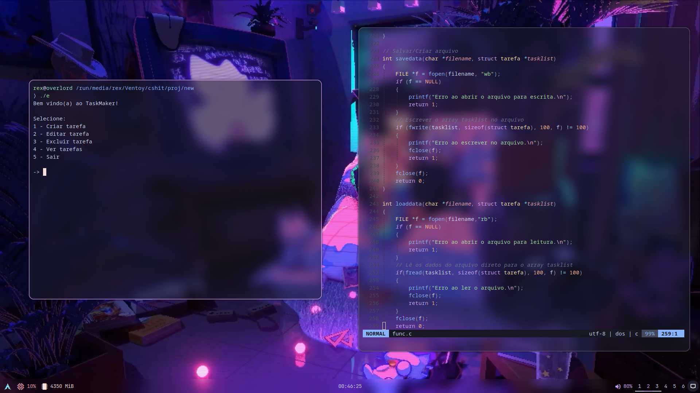

# TaskMaker
Projeto de 2º semestre no curso de ciência da computação da FEI. Feito em C.
## Compilação

Para compilar, use o [GCC](https://gcc.gnu.org/). Para usar o GCC no Windows, use o [MinGW](https://sourceforge.net/projects/mingw/).

GCC no Arch Linux e seus derivados (provavelmente já está instalado na sua distro):
```bash
  sudo pacman -S gcc
```
## Imagens



